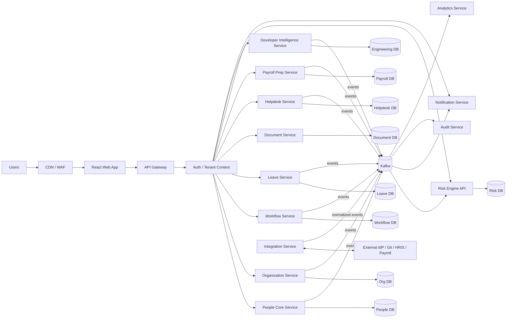

# 02 Architecture Overview

Version: 0.1  
Status: Draft

## Architecture Summary

stack-work-360 is a multi-tenant enterprise SaaS platform built as DDD-aligned Spring Boot microservices, React frontend clients, PostgreSQL service-owned databases, and Kafka event streams.

> Assumption: The platform is deployed as SaaS first, with private-cloud or customer-managed deployment considered only after enterprise-market validation.

## High-Level Diagram

## Component Responsibilities

| Component | Responsibility |
|---|---|
| React Web App | Role-specific UX for employees, managers, HR, IT/security, finance, engineering leaders |
| API Gateway | Routing, auth enforcement, rate limits, request shaping, version routing |
| People Core | Worker records, employment state, lifecycle events |
| Organization | Teams, reporting lines, cost centers, locations, org chart |
| Workflow | Human approvals, task orchestration, state machines, saga coordination |
| Leave | Leave policies, requests, balances, calendars |
| Document | Metadata, retention, access policies, secure file references |
| Helpdesk | HR/IT tickets, SLA, comments, routing |
| Payroll Prep | Payroll inputs, pay-cycle approval, exports |
| Developer Intelligence | Repositories, services, ownership, access requests, skills evidence |
| Risk Engine | Rule and model-based risk detection from event streams |
| Notification | Email, Slack/Teams, in-app, webhook notifications |
| Audit | Immutable audit records and evidence export |
| Analytics | Read models, dashboards, metrics aggregation |
| Integration | External systems, connector normalization, webhook ingestion |

## Request/Data Flow

1. Browser loads React assets through CDN.
2. React calls API Gateway with OIDC access token.
3. Gateway resolves tenant context and routes to backend service.
4. Owning service validates authorization and writes to its PostgreSQL database.
5. Service publishes domain event to Kafka through transactional outbox.
6. Consumers update read models, start workflows, send notifications, or calculate risk.
7. Audit Service records user, service, and data-change activity.

## Cross-References

- Service boundaries: [03-microservices-decomposition.md](03-microservices-decomposition.md)
- System design details: [04-system-design-deep-dive.md](04-system-design-deep-dive.md)
- Events: [06-event-driven-architecture.md](06-event-driven-architecture.md)
- Deployment: [../infra/08-infra-deployment.md](../infra/08-infra-deployment.md)
