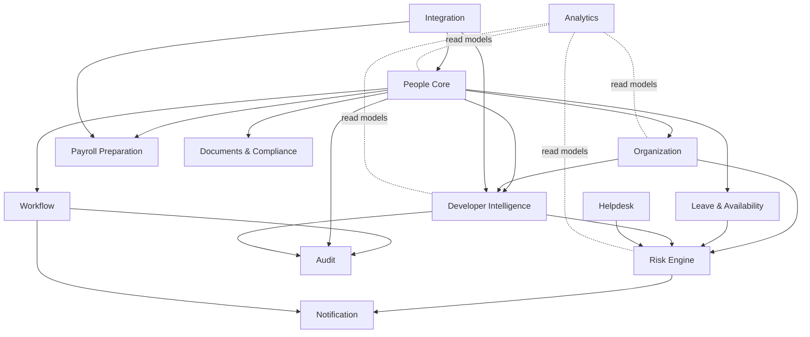

# 03 Microservices Decomposition

Version: 0.1  
Status: Draft

## Decomposition Principles

- Services are aligned to DDD bounded contexts.
- Each service owns its write model and database schema.
- Cross-service mutation is forbidden except through public APIs or events.
- Kafka events publish facts that already happened, not remote procedure calls.
- Shared libraries are limited to observability, auth helpers, error contracts, and generated schemas.

> Assumption: Each bounded context maps to one primary service at MVP, but high-throughput contexts may split command, query, or worker services later.

## Bounded Contexts and Services

| Bounded context | Service | Owns | Does not own |
|---|---|---|---|
| Identity & Access | Auth Service | Tenant-aware auth integration, app roles, permission policies | External IdP credentials |
| People Core | People Core Service | Worker profile, employment state, lifecycle events | Org hierarchy, payroll calculations |
| Organization | Organization Service | Teams, departments, reporting lines, locations, cost centers | Employee legal identity |
| Workflow | Workflow Service | Approval flows, task state, workflow templates | Domain facts owned by source services |
| Leave & Availability | Leave Service | Leave policies, balances, requests, availability projections | Payroll disbursement |
| Documents & Compliance | Document Service | Document metadata, classification, retention, acknowledgements | Raw object storage platform |
| Helpdesk | Helpdesk Service | Tickets, comments, routing, SLA timers | Employee master data |
| Payroll Preparation | Payroll Prep Service | Payroll period inputs, deductions, adjustments, exports | Bank transfers/tax filing |
| Developer Intelligence | Developer Intelligence Service | Repos, services, ownership, access requests, engineering skills evidence | Git provider source-of-truth data |
| Risk | Risk Engine Service | Risk signals, scores, alerts, explanations | Original domain records |
| Notification | Notification Service | Delivery preferences, notification templates, delivery logs | Domain workflows |
| Audit | Audit Service | Immutable audit events and evidence export | Domain state reconstruction |
| Analytics | Analytics Service | Cross-domain read models and dashboards | Transactional writes |
| Integration | Integration Service | Connector configuration, webhook ingestion, normalization | Long-term domain ownership |

## Context Map

## Ownership Rationale

| Service | Ownership rationale |
|---|---|
| People Core | Highest-integrity lifecycle state; central source for worker identity within the platform |
| Organization | Org structures change independently from worker lifecycle and need specialized hierarchy queries |
| Workflow | Reusable engine serving multiple domains; owns process state, not domain truth |
| Developer Intelligence | Engineering metadata has distinct providers, scale, and privacy controls |
| Risk Engine | Consumes multiple domains and must not become write owner for source facts |
| Audit | Independent immutable record to avoid tampering by source services |

## Service Communication Rules

| Interaction | Preferred pattern |
|---|---|
| User command | REST through API Gateway |
| Internal low-latency read | REST/gRPC with timeouts and circuit breakers |
| Domain fact propagation | Kafka event |
| Workflow orchestration | Saga through Workflow Service and events |
| Reporting | Analytics read model |
| Cross-service validation | Local cached reference data when possible; synchronous API only when freshness is required |

## Anti-Corruption Layers

Integration Service must translate provider-specific concepts into platform contracts. Domain services must not import provider-specific models from GitHub, Okta, payroll systems, or HRIS platforms.
