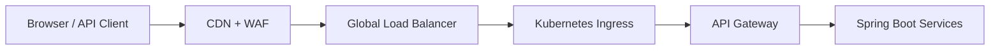
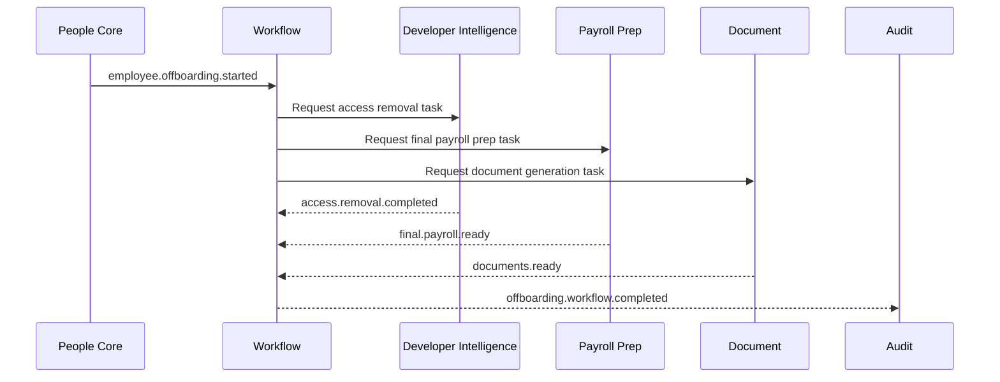

# 04 System Design Deep Dive

Version: 0.1  
Status: Draft

## Load Balancing and API Gateway

Traffic path:

The API Gateway owns:

- OIDC token validation.
- Tenant resolution.
- Rate limiting.
- API version routing.
- Request/response size limits.
- Correlation ID propagation.
- Edge-level authorization checks.

Service-level authorization remains mandatory because gateway checks are not sufficient for zero-trust.

## Caching Strategy

| Layer | Use cases | Invalidation |
|---|---|---|
| CDN | Static React assets, public metadata, downloadable templates | Versioned asset URLs |
| Gateway | Short-lived tenant config, JWKS keys, API metadata | TTL + config events |
| Application | Role permissions, org lookups, reference data | TTL + Kafka invalidation events |
| Database | PostgreSQL query cache behavior through indexes/materialized views | Service-owned refresh policy |
| Analytics | Dashboard read models | Event-driven projection rebuilds |

> Assumption: Redis is allowed as an application cache even though PostgreSQL remains the mandated persistent database.

## Database Indexing, Partitioning, and Sharding

Baseline:

- Every tenant-owned table includes `tenant_id`.
- High-cardinality tenant filters use composite indexes beginning with `tenant_id`.
- Audit and event-log tables are partitioned by time and tenant hash.
- Large tenants may move to dedicated database instances.

| Data type | Strategy |
|---|---|
| Employee profiles | Composite indexes on `tenant_id`, `worker_id`, `employment_status`, `manager_id` |
| Leave requests | Index on `tenant_id`, `worker_id`, `status`, `start_date`, `end_date` |
| Workflow tasks | Index on `tenant_id`, `assignee_id`, `state`, `due_at` |
| Audit logs | Monthly partitions; index on `tenant_id`, `actor_id`, `resource_type`, `occurred_at` |
| Engineering ownership | Graph-like relational model with indexes on `service_id`, `repo_id`, `owner_worker_id` |

Sharding decision:

- MVP uses pooled multi-tenant databases with tenant-aware partitioning.
- Enterprise tier supports tenant isolation by database cluster for regulatory or scale reasons.

## Replication, Consistency Models, and CAP Trade-Offs

| Service | Consistency model | CAP posture |
|---|---|---|
| People Core | Strong consistency for worker lifecycle writes | Prefer consistency over availability for lifecycle mutations |
| Organization | Strong consistency for hierarchy writes; eventual for read-model consumers | CP for writes, AP for projections |
| Leave | Strong for balance mutation; eventual for analytics | CP for leave approval |
| Payroll Prep | Strong for payroll-period close; eventual for dashboard | CP for financial preparation |
| Developer Intelligence | Eventual for provider metadata; strong for internal access approval state | Mixed; external provider sync is AP |
| Risk Engine | Eventual consistency from source events | AP with explanatory freshness timestamps |
| Analytics | Eventual consistency | AP |
| Audit | Append-only strong write acceptance per region | CP within region; replicated for DR |

## Rate Limiting, Throttling, and Backpressure

Controls:

- Gateway token-bucket limits per tenant, user, API client, and endpoint class.
- Kafka producer quotas per service.
- Consumer concurrency limits by partition and tenant priority.
- Backpressure through bounded queues, `429` responses, and retry-after headers.
- Bulk import jobs scheduled through asynchronous workflow queues.

## Resilience Patterns

| Pattern | Required use |
|---|---|
| Timeouts | Every outbound HTTP/gRPC call |
| Circuit breakers | Calls to external providers and non-critical internal services |
| Bulkheads | Thread pools per dependency class |
| Retries with backoff | Transient failures only; never blind retries on non-idempotent operations |
| Fallbacks | Cached reads or degraded UI for non-critical data |
| Dead-letter queues | Poison Kafka messages and failed asynchronous workflows |

## Distributed Transactions

### Saga Pattern

Use sagas for multi-service business workflows.

Example: offboarding.

### CQRS

Use CQRS where command integrity and dashboard reads differ:

- Org chart.
- Risk dashboard.
- Workforce analytics.
- Engineering ownership map.

### Event Sourcing

Event sourcing applies selectively:

- Workflow state transitions.
- Audit trails.
- Risk signal history.

It does not apply to every CRUD service by default.

## Idempotency and Delivery Semantics

Kafka consumers assume at-least-once delivery. Exactly-once semantics may be used inside Kafka Streams or transactional producer workflows, but business logic must remain idempotent.

Required:

- Idempotency key for public write APIs.
- Consumer processed-message table keyed by `event_id` and consumer name.
- Natural business keys for repeat-safe operations.
- Transactional outbox for database write + event publish.
- Dead-letter topic after bounded retry attempts.

## Service Discovery and Inter-Service Communication

| Communication | Standard |
|---|---|
| North-south traffic | REST through API Gateway |
| East-west synchronous | REST first; gRPC allowed for high-throughput internal APIs |
| Asynchronous | Kafka |
| Service discovery | Kubernetes DNS and service mesh registry |
| Service-to-service auth | mTLS identity plus service authorization policy |

## Distributed Tracing, Logging, and Metrics

Every request/event carries:

- `trace_id`
- `span_id`
- `correlation_id`
- `tenant_id`
- `actor_id` when user-originated
- `event_id` when event-originated

OpenTelemetry is required for traces, metrics, and log correlation. Details are in [../infra/09-observability-plan.md](../infra/09-observability-plan.md).

## Multi-Region, HA, and DR

MVP:

- Single active region.
- Multi-AZ Kubernetes and PostgreSQL.
- Cross-region backup replication.

Enterprise target:

- Active-passive regional failover for core services.
- Region-local Kafka clusters with replicated critical topics.
- Tenant pinning for data residency.
- DR drills every quarter.

> Assumption: Active-active writes are not required for MVP due to complexity around HR and payroll consistency.

## Zero-Trust Security

Required:

- OIDC user authentication.
- mTLS between services.
- Service mesh authorization.
- Secrets from managed secrets provider.
- Tenant-scoped authorization checks in every service.
- Least-privilege database credentials per service.
- Audit event for sensitive reads and writes.

## Horizontal Scalability and Autoscaling

Scale dimensions:

- Stateless Spring Boot pods scale by CPU, memory, request rate, and queue lag.
- Kafka consumers scale by partition count and consumer groups.
- PostgreSQL scales vertically first, then through read replicas, partitions, and tenant isolation.
- React frontend scales through CDN.

## Chaos Engineering

Required scenarios:

- Kafka broker unavailable.
- Kafka consumer lag spike.
- PostgreSQL primary failover.
- External IdP outage.
- Git provider webhook storm.
- Notification provider failure.
- One service unavailable during onboarding/offboarding saga.
- Regional read-only degradation.

Chaos tests must run first in non-production and later as controlled game days in production.
