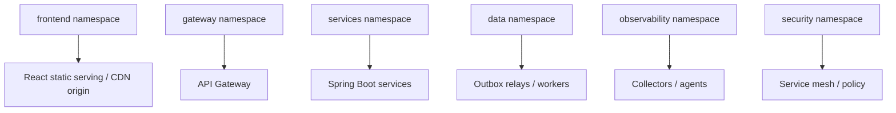

# 08 Infrastructure and Deployment

Version: 0.1  
Status: Draft

## Deployment Model

stack-work-360 runs on Kubernetes with Docker images for each frontend and backend component.

> Assumption: The first production deployment uses a managed Kubernetes service, managed PostgreSQL, managed Kafka or operator-managed Kafka, and managed object storage.

## Environments

| Environment | Purpose | Data |
|---|---|---|
| Local | Developer iteration through Docker Compose or local Kubernetes | Synthetic |
| Dev | Shared integration | Synthetic |
| QA | Test automation and exploratory testing | Synthetic/anonymized |
| Staging | Production-like validation | Anonymized |
| Production | Customer traffic | Live |
| DR | Disaster recovery standby | Replicated |

## Kubernetes Layout

Workloads:

- Deployments for stateless APIs.
- Jobs/CronJobs for maintenance tasks.
- Stateful systems preferably managed outside application cluster.
- Horizontal Pod Autoscalers for APIs and consumers.
- PodDisruptionBudgets for critical services.

## CI/CD Pipeline

Stages:

1. Source validation.
2. Compile/build.
3. Unit tests.
4. Static analysis and dependency scanning.
5. Container build.
6. Container vulnerability scan.
7. Contract tests.
8. Integration tests.
9. Publish artifact.
10. Deploy to dev.
11. Automated smoke tests.
12. Promote to QA/staging.
13. Performance and security gates.
14. Canary or blue-green production release.
15. Post-deploy verification and automated rollback checks.

## Release Strategy

| Release type | Use |
|---|---|
| Canary | Most backend services and consumers |
| Blue-green | API Gateway, high-risk frontend releases, major workflow changes |
| Feature flags | Product capability rollout by tenant/cohort |
| Dark launch | Event consumers and read models before UI exposure |

## Configuration

- Twelve-factor configuration.
- No secrets in images or Git.
- Environment-specific config through Kubernetes config and secret providers.
- Feature flags are centrally managed and audited.

## Database Deployment

- Service-owned migration pipeline.
- Backward-compatible schema changes.
- Migrations run before service rollout where safe.
- Rollback plans documented for every migration.

## Kafka Deployment

- Topic creation through GitOps-controlled definitions.
- Schema Registry compatibility checks in CI.
- Partition changes reviewed by platform team.
- Consumer lag alerts required before production enablement.

## Multi-Team Scale Controls

- Shared golden service template for Spring Boot.
- Shared React app shell and design system.
- Platform-owned CI/CD templates.
- Standard observability sidecars/agents.
- Architecture review for new service creation.
- Dependency version policy in [../governance/14-engineering-standards.md](../governance/14-engineering-standards.md).
